# SynthiCal AI - Technical Design Document

**Version**: 1.0  
**Date**: January 2025  
**Author**: Engineering Team  
**Status**: Design Phase

---

## 1. Project Overview

### Problem Statement
Based on the [product requirements](https://www.tharunpoduru.com/projects/synthicalai), we need to solve a critical productivity problem: busy professionals, event organizers, and students frequently encounter event information scattered across emails, websites, PDFs, and social media. Manually extracting and inputting these details into calendar applications is tedious, error-prone, and time-consuming.

### Solution Vision
SynthiCal AI will be an intelligent web application that automatically extracts event details from various unstructured inputs (text, URLs, documents, images, and audio) and converts them into standardized calendar files (.ics) or direct calendar integrations. The system will leverage Google Gemini AI to understand context, parse dates and times, and structure event data accurately.

### Success Criteria
- Extract event data with >85% accuracy from diverse input sources
- Process most requests within 10 seconds
- Support 500+ concurrent users at launch
- Achieve intuitive user experience requiring no learning curve
- Maintain 99.5% uptime with serverless architecture

---

## 2. System Architecture Design

### High-Level Architecture Decision

We will build a serverless web application using Firebase platform for rapid deployment and auto-scaling. The architecture follows a clean separation between frontend presentation, backend processing, and AI intelligence layers.

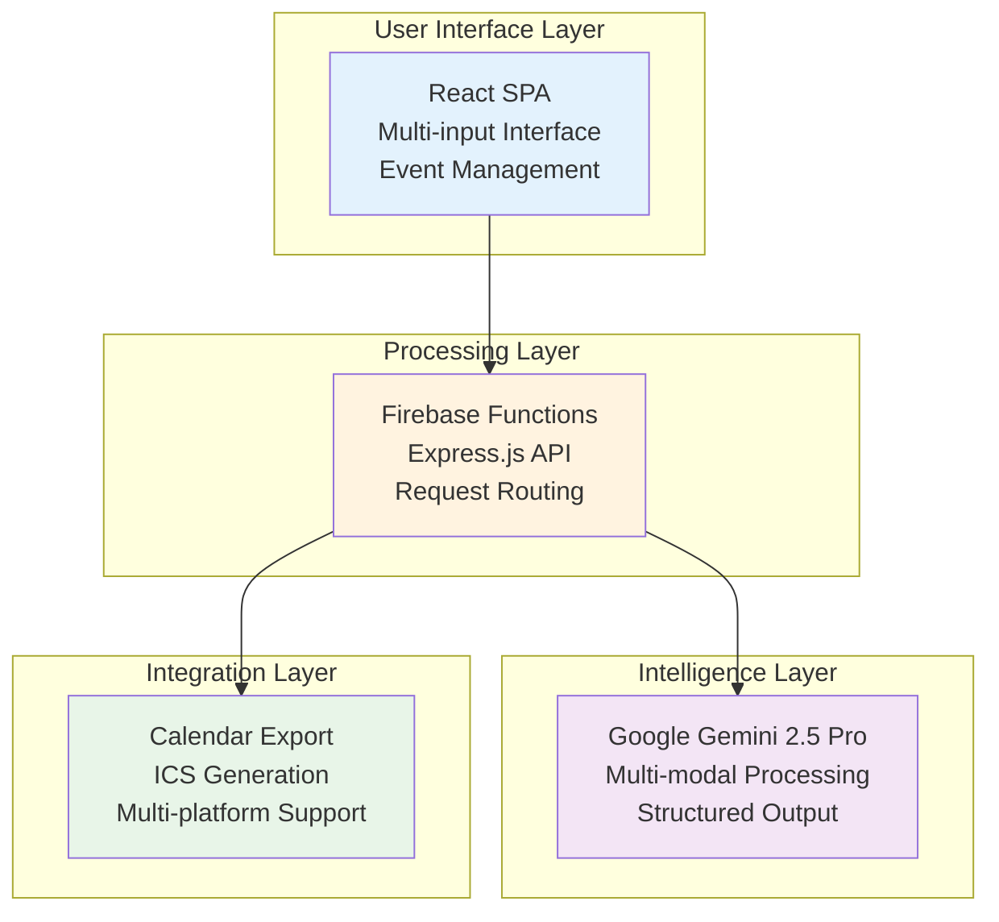

**Architecture Rationale:**
- **Serverless**: Eliminates infrastructure management, provides auto-scaling, and reduces operational costs
- **Firebase Platform**: Integrated hosting, functions, and analytics in one ecosystem
- **React SPA**: Modern, responsive user interface with component reusability
- **AI-First**: Leverage Google's most capable model for maximum extraction accuracy

---

## 3. Frontend Design

### User Interface Strategy

The frontend will be a single-page React application optimized for simplicity and speed. Users should be able to extract events in under 30 seconds from any supported input method.

#### Core User Flow
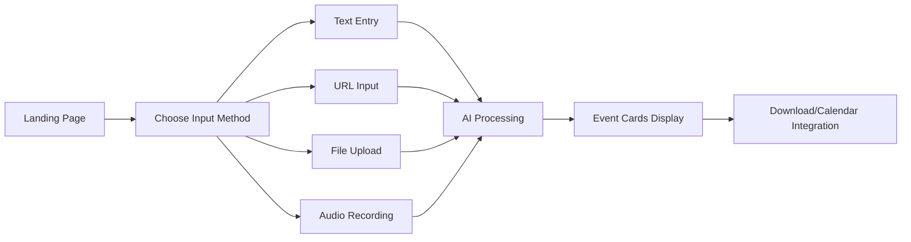

#### Component Architecture
We'll design a modular component system that can easily accommodate future input methods:

```mermaid
graph TD
    App[App Component<br/>State Management<br/>API Coordination]
    
    App --> InputTabs[Input Method Tabs<br/>Text | URL | File | Audio]
    App --> EventDisplay[Event Cards Grid<br/>Responsive Layout]
    App --> ExportActions[Export Controls<br/>Bulk & Individual Actions]
    
    InputTabs --> TextInput[Text Area Component]
    InputTabs --> URLInput[URL Input Component]
    InputTabs --> FileUpload[File Upload Component]
    InputTabs --> AudioRecorder[Audio Recorder Component]
    
    EventDisplay --> EventCard[Individual Event Card<br/>Title, Date, Location, Description]
    EventCard --> CalendarButton[Add to Calendar Button]
    EventCard --> DownloadButton[Download ICS Button]
```

### Technology Choices

**React 19+ with Modern Features:**
- React Server Components for faster initial loads
- Concurrent features for better user experience during processing
- Built-in form handling and validation

**Vite Build System:**
- Fast development server with hot module replacement
- Optimized production builds with tree-shaking
- Native ES modules support

**TailwindCSS Styling:**
- Utility-first approach for rapid development
- Built-in responsive design patterns
- Easy theming and customization

### Implementation Plan

**App.jsx - Main Application Container**
This will be our primary state container managing all user interactions, API calls, and data flow. The component will handle:

- **State Management**: Events array, loading states, error handling, user selections
- **Input Processing**: Coordinate different input methods (text, URL, file, audio)
- **API Integration**: Make calls to Firebase Functions for event extraction
- **Export Functionality**: Handle bulk and individual event downloads

**AudioRecorder.jsx - Voice Input Component**
A sophisticated audio recording component that provides:

- **Media API Integration**: Request microphone permissions and handle audio capture
- **Recording Controls**: Start/stop recording with visual feedback and timer
- **Quality Settings**: Configure audio settings for optimal Gemini processing
- **File Generation**: Convert recorded audio to appropriate format for upload

**EventCards.jsx - Event Display Component**
The primary interface for displaying and interacting with extracted events:

- **Grid Layout**: Responsive card layout that works on all screen sizes
- **Interactive Selection**: Click-to-select functionality for bulk operations
- **Rich Display**: Show all event details with proper formatting
- **Individual Actions**: Per-event calendar integration and download options

**AddToCalendar.jsx - Calendar Integration**
A reusable component providing direct calendar integration:

- **Multi-Platform Support**: Google Calendar, Apple Calendar, Outlook.com
- **Smart Detection**: Automatically determine best integration method
- **Fallback Options**: ICS download for unsupported platforms

---

## 4. Backend API Design

### API Architecture

We'll build a RESTful API using Express.js on Firebase Functions. The API will be stateless, focusing on data transformation and AI coordination.

#### Endpoint Design
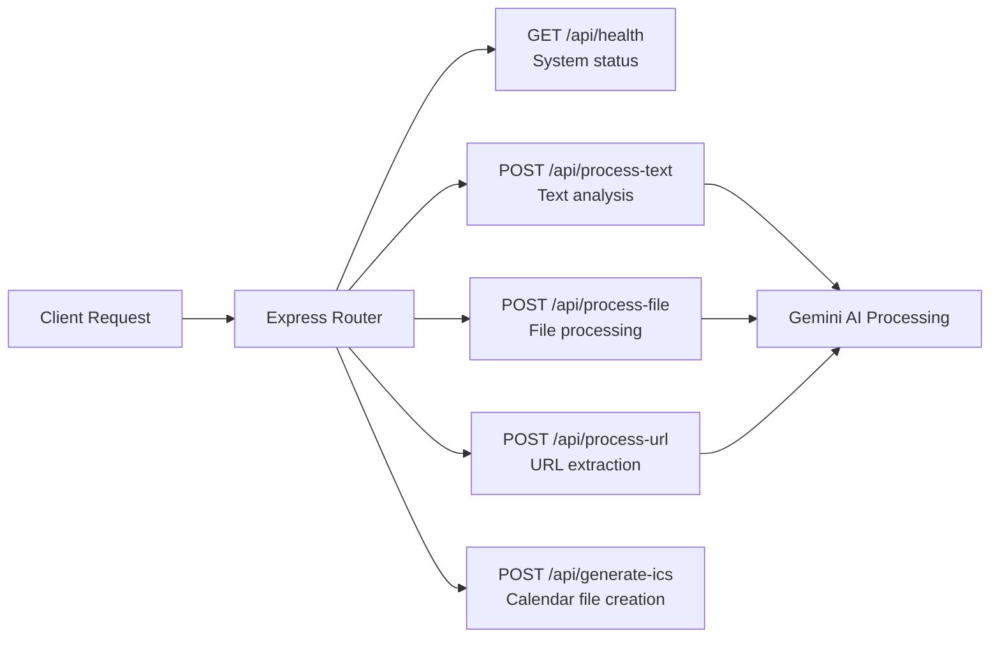

#### Implementation Strategy

**functions/index.js - Main Express Application**
This will be our Firebase Function entry point containing:

- **Express Setup**: CORS configuration, JSON parsing, error handling
- **Route Definitions**: All API endpoints with proper middleware
- **Security**: Input validation, rate limiting, error sanitization
- **Monitoring**: Request logging and performance tracking

**functions/utils/gemini.js - AI Integration Module**
Core AI processing functionality:

- **Client Initialization**: Configure GoogleGenerativeAI client with API key
- **Prompt Engineering**: Structured prompts for consistent JSON output
- **Context Management**: Handle timezone conversion and current time context
- **Response Parsing**: Robust JSON parsing with fallback error handling

**functions/processors/file.js - File Processing Pipeline**
Handle multimodal file uploads:

- **Upload Management**: Resumable upload to Gemini Files API
- **State Polling**: Wait for file processing to complete
- **Content Analysis**: Send file reference to Gemini for event extraction
- **Cleanup**: Automatic file deletion after processing

**functions/processors/url.js - Web Content Extraction**
Intelligent web scraping and analysis:

- **Structured Data**: First attempt JSON-LD schema.org extraction
- **Content Extraction**: Fallback to main content text extraction
- **AI Analysis**: Send content to Gemini for event understanding
- **Error Handling**: Graceful degradation for unreachable URLs

**functions/utils/ics-generator.js - Calendar File Generation**
Standards-compliant ICS file creation:

- **Event Conversion**: Transform our event structure to ICS format
- **Timezone Handling**: Proper UTC conversion and timezone support
- **Metadata**: Include unique IDs, creation timestamps, and source information

### Data Structures

**Standardized Event Format:**
```javascript
{
  "title": "Event Name",
  "start_datetime": "2025-01-15T14:00:00Z",  // Always UTC ISO
  "end_datetime": "2025-01-15T15:00:00Z",    // Always UTC ISO
  "location": "Conference Room A",
  "description": "Event details with context",
  "original_link": "https://source-url.com"  // For reference
}
```

---

## 5. AI Integration Strategy

### Gemini AI Implementation

We'll use Google Gemini 2.5 Pro as our primary intelligence engine due to its multimodal capabilities and structured output support.

#### Prompt Engineering Strategy

The key to successful event extraction is crafting precise prompts that guide Gemini to produce consistent, structured output. Our approach:

**Core Prompt Template:**
```
You are an expert event extraction assistant. 
Output ONLY JSON: {
  "events": [
    {
      "title": "...",
      "start_datetime": "UTC ISO format",
      "end_datetime": "UTC ISO format", 
      "location": "...",
      "description": "..."
    }
  ]
}

Current time context: {current_datetime}
User timezone: {user_timezone}
Input type: {text|url|file}

Instructions:
- Convert all times to UTC
- If end time missing, add 1 hour to start
- Handle relative dates like "tomorrow", "next Friday"
- Extract location even if vague
- Include comprehensive description

Content to analyze:
{user_input}
```

#### Context Management

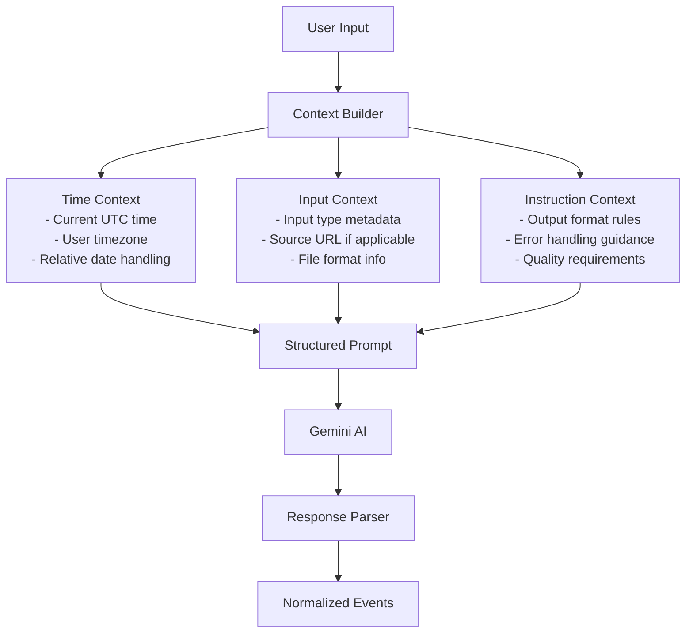

The context builder will be crucial for accuracy. By providing current time information and the user's timezone, we enable Gemini to correctly interpret relative dates like "tomorrow" or "next Friday". The input context helps Gemini understand whether it's analyzing a web page, document, or audio transcript.

### Processing Pipeline

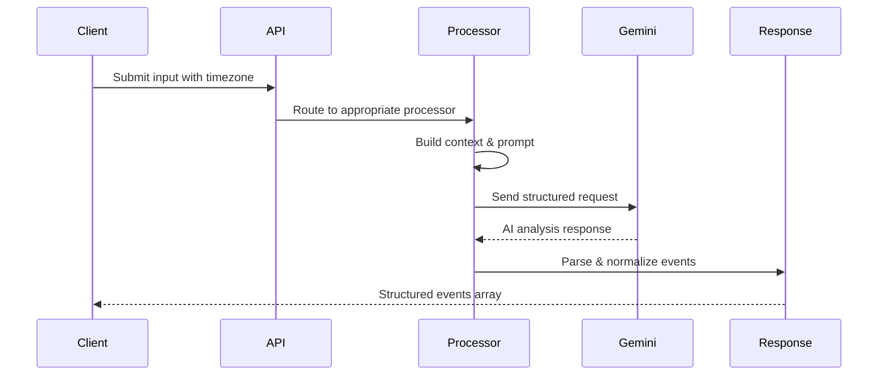

---

## 6. Component Deep Dive

### AudioRecorder Component Design

The audio recording component is one of our most complex frontend pieces, requiring careful handling of browser APIs and user experience.

**Implementation Strategy:**

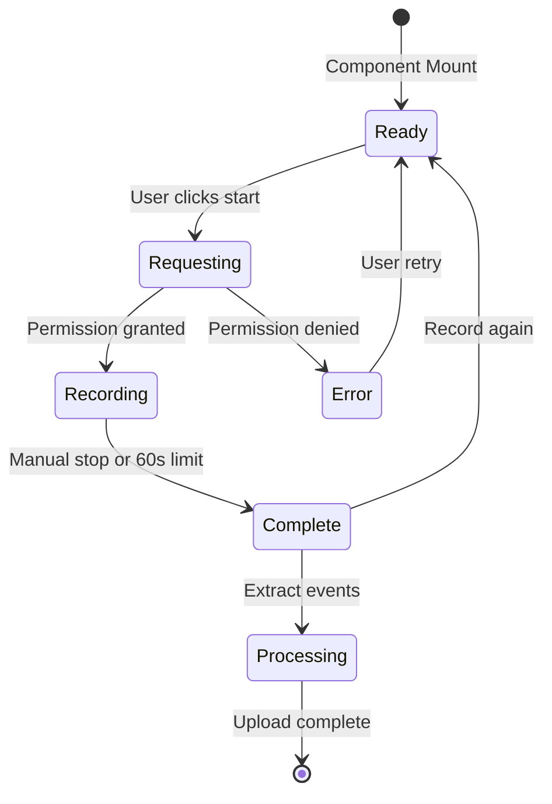

**Key Technical Requirements:**
- **High-Quality Audio**: Configure MediaRecorder with optimal settings for speech recognition
- **Visual Feedback**: Real-time recording indicator and countdown timer
- **Error Handling**: Graceful handling of permission denials and unsupported browsers
- **File Management**: Convert Blob to File object with appropriate MIME type

### EventCards Component Design

This component serves as the primary interface for users to interact with extracted events.

**Design Principles:**
- **Scannable Layout**: Important information (title, date, time) prominently displayed
- **Interactive Selection**: Easy multi-select for bulk operations
- **Responsive Design**: Works seamlessly on mobile and desktop
- **Accessible**: Proper ARIA labels and keyboard navigation

**Component Structure:**
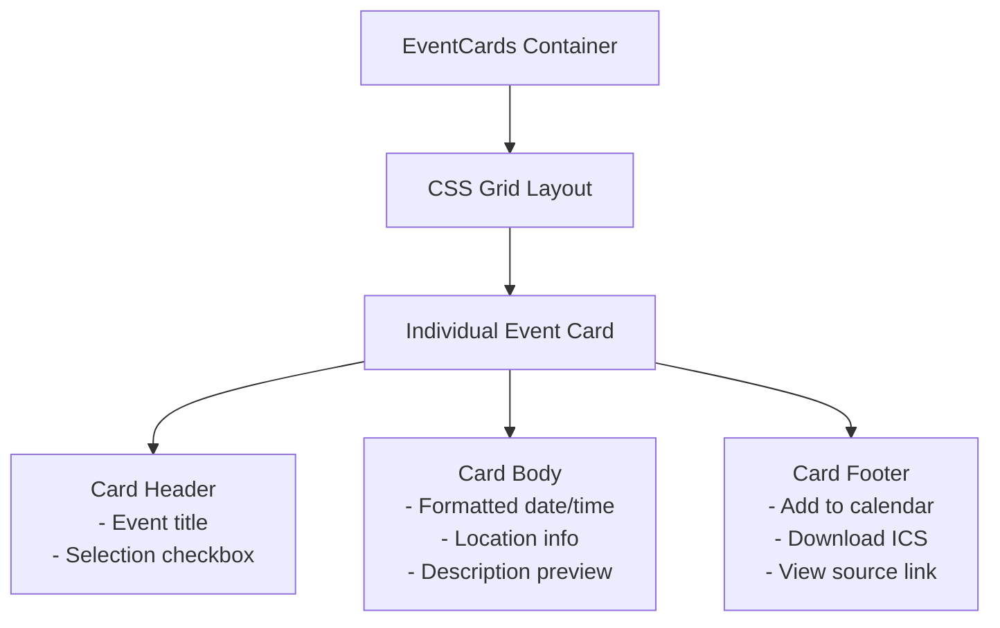

### File Processing Architecture

File processing needs to handle multiple formats while maintaining security and performance.

**Processing Flow:**
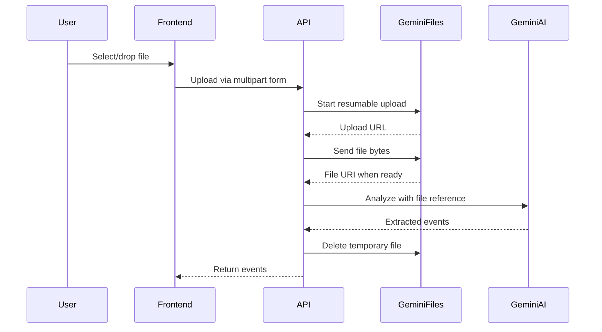

**Security Considerations:**
- **File Size Limits**: 25MB maximum to prevent abuse
- **Type Validation**: Strict MIME type checking
- **Temporary Storage**: Files automatically deleted after processing
- **Error Handling**: Graceful failure for corrupted or unsupported files

---

## 7. Performance and Scalability Strategy

### Frontend Performance

**Bundle Optimization Strategy:**
- **Code Splitting**: Separate bundles for each input method
- **Lazy Loading**: Load components only when needed
- **Tree Shaking**: Eliminate unused code from dependencies
- **Asset Optimization**: Compressed images and optimized fonts

**Runtime Performance:**
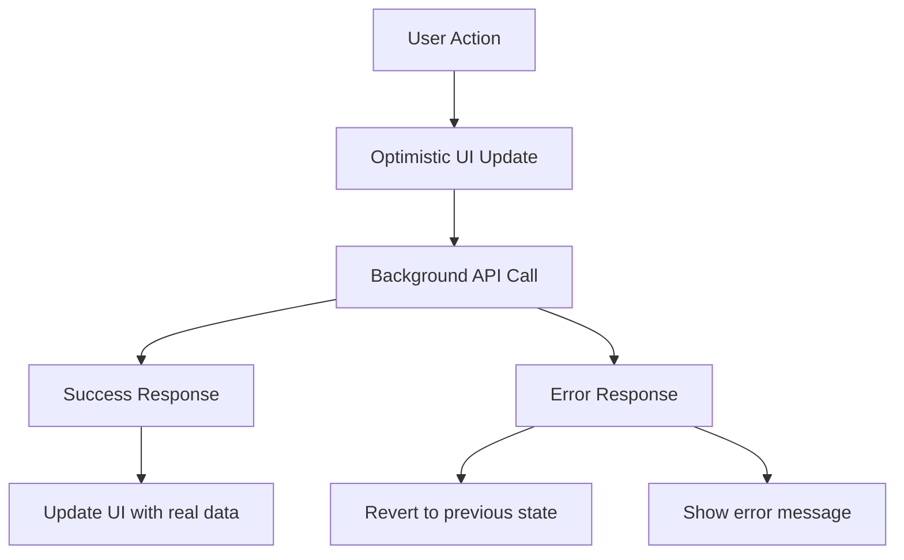

### Backend Scalability

**Firebase Functions Auto-Scaling:**
Firebase Functions automatically scales based on incoming requests, but we need to design for efficiency:

- **Stateless Design**: Each function invocation is independent
- **Connection Pooling**: Reuse HTTP connections to external APIs
- **Intelligent Caching**: Cache Gemini API responses for identical inputs (with privacy considerations)
- **Error Recovery**: Exponential backoff for failed requests

**Cost Optimization:**
- **Request Deduplication**: Prevent duplicate processing of identical content
- **Prompt Optimization**: Minimize token usage while maintaining accuracy
- **Resource Monitoring**: Track usage patterns and optimize accordingly

---

## 8. Security and Privacy Design

### Privacy-First Architecture

Based on the PRD requirement that "data used for event generation shall not be stored beyond session lifecycle", we'll implement a strict no-storage policy:

**Data Flow Security:**
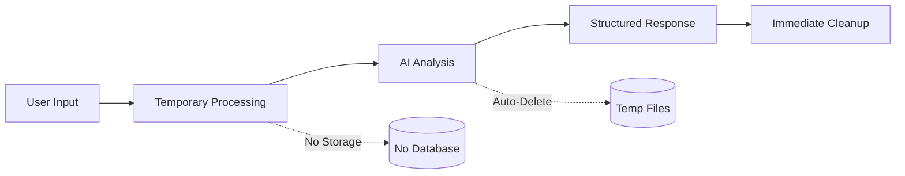

**Security Measures:**
- **Input Sanitization**: Comprehensive validation of all user inputs
- **API Security**: Secure Firebase Functions with proper authentication
- **HTTPS Enforcement**: All communications over encrypted connections
- **Error Message Sanitization**: Prevent information leakage through errors

### Content Security

**Malicious Input Protection:**
- **File Type Validation**: Strict checking of uploaded file types
- **Size Limits**: Prevent resource exhaustion attacks
- **Content Scanning**: Basic checks for malicious patterns
- **Sandboxed Processing**: Gemini API provides isolated processing environment

---

## 9. Analytics and Monitoring

### User Analytics Strategy

We'll implement privacy-respecting analytics to understand user behavior and improve the product:

**Key Metrics Implementation:**
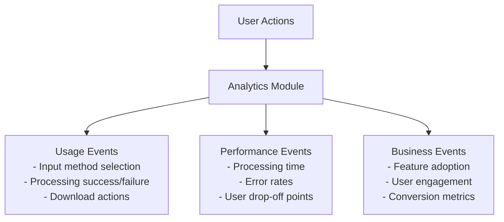

**Implementation via frontend/src/analytics.js:**
- **Google Analytics Integration**: Track custom events and user flows
- **Privacy Compliance**: No personal data collection
- **Performance Monitoring**: Track processing times and success rates
- **Error Tracking**: Understand common failure points

### System Monitoring

**Backend Monitoring Strategy:**
- **Function Performance**: Execution time, memory usage, cold starts
- **External API Health**: Gemini API response times and error rates
- **Cost Tracking**: Monitor spending on AI API calls
- **Error Alerting**: Immediate notification of critical failures

---

## 10. Implementation Roadmap

### Phase 1: Foundation (Weeks 1-4)

**Week 1-2: Project Setup**
- Initialize React project with Vite and TailwindCSS
- Set up Firebase project with Functions and Hosting
- Configure development environment with emulators
- Implement basic UI shell with tab navigation

**Week 3-4: Core Text Processing**
- Implement Gemini AI integration for text processing
- Build text input interface with validation
- Create event card display component
- Add basic ICS download functionality

### Phase 2: Multi-Modal Input (Weeks 5-8)

**Week 5-6: File and Audio Processing**
- Implement file upload with drag-and-drop
- Build audio recording component with MediaRecorder API
- Integrate Gemini Files API for multimodal processing
- Add progress indicators and error handling

**Week 7-8: URL Processing and Polish**
- Implement web scraping with JSON-LD extraction
- Add URL input processing pipeline
- Build calendar integration with add-to-calendar-button
- Implement bulk selection and download features

### Phase 3: Production Ready (Weeks 9-12)

**Week 9-10: Performance and Security**
- Optimize bundle size and loading performance
- Implement comprehensive error handling and validation
- Add security headers and input sanitization
- Performance testing and optimization

**Week 11-12: Launch Preparation**
- Analytics implementation and testing
- Mobile responsiveness and accessibility
- Documentation and deployment automation
- User testing and feedback integration

---

## 11. Technical Risks and Mitigation

### Primary Risk: AI Dependency

**Risk**: Over-reliance on Gemini API for core functionality
**Impact**: Service disruption if API is unavailable or accuracy degrades
**Mitigation Strategy:**
- Implement robust error handling with user-friendly fallbacks
- Monitor API health and implement circuit breaker patterns
- Design prompts for maximum reliability and consistency
- Plan for alternative AI providers as backup options

### Secondary Risk: Scalability Bottlenecks

**Risk**: Unexpected traffic spikes overwhelming Firebase Functions
**Impact**: Slow response times or service unavailability
**Mitigation Strategy:**
- Configure appropriate concurrency limits and timeouts
- Implement request queuing for non-critical operations
- Monitor performance metrics and set up auto-scaling alerts
- Design stateless functions for horizontal scaling

### Privacy Risk: Data Leakage

**Risk**: User data inadvertently stored or exposed
**Impact**: Privacy violations and loss of user trust
**Mitigation Strategy:**
- Implement strict data lifecycle management
- Regular audits of data handling practices
- Automated cleanup verification
- Clear privacy policy and transparent data handling

---

## 12. Success Metrics

### Technical Success Metrics

**Performance Targets:**
- **Processing Time**: 95% of requests completed under 10 seconds
- **Accuracy Rate**: >85% of extracted events are correctly structured
- **Uptime**: 99.5% availability during business hours
- **Error Rate**: <2% of requests result in unrecoverable errors

**User Experience Metrics:**
- **Time to First Event**: <30 seconds from input to display
- **Mobile Responsiveness**: Full functionality on devices >320px width
- **Accessibility**: WCAG 2.1 AA compliance
- **Browser Support**: Works on 95% of modern browser versions

### Business Success Metrics

**User Engagement:**
- **User Acquisition**: 500+ unique users in first 3 months
- **Session Quality**: Average 2+ events extracted per session
- **Feature Adoption**: >80% of users try multiple input methods
- **User Retention**: >60% return within 7 days

**Product Market Fit:**
- **User Satisfaction**: >4.0/5.0 average rating
- **Support Volume**: <5% of users require assistance
- **Word of Mouth**: >50 Net Promoter Score
- **Platform Growth**: Consistent month-over-month user growth

---

## 13. Conclusion

This technical design provides a comprehensive blueprint for building SynthiCal AI as described in the [product requirements](https://www.tharunpoduru.com/projects/synthicalai). The design emphasizes:

**Core Principles:**
- **User-Centric Design**: Every technical decision prioritizes user experience
- **Privacy by Design**: No persistent storage with automatic cleanup
- **Scalable Architecture**: Serverless design ready for growth
- **AI-First Approach**: Leverage cutting-edge AI for maximum accuracy

**Technical Excellence:**
- Modern React frontend with optimal performance
- Robust Firebase backend with auto-scaling
- Comprehensive error handling and security
- Privacy-respecting analytics and monitoring

**Implementation Readiness:**
The design provides specific implementation guidance for each component, clear data structures, and a realistic timeline for delivery. The modular architecture ensures the system can evolve with user needs and technological advances.

By following this design, we will deliver a product that solves real user problems while maintaining technical excellence and operational simplicity.

---

**Document Status**: Ready for Implementation  
**Next Phase**: Development Environment Setup  
**Review Cycle**: Weekly during implementation
